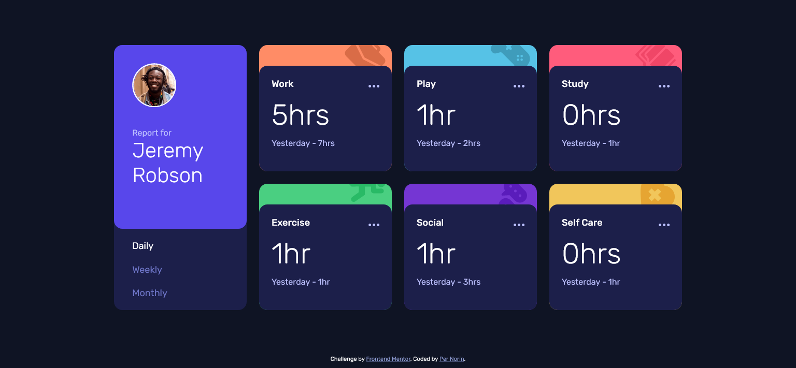

# Frontend Mentor - Time tracking dashboard solution

This is a solution to the [Time tracking dashboard challenge on Frontend Mentor](https://www.frontendmentor.io/challenges/time-tracking-dashboard-UIQ7167Jw). Frontend Mentor challenges help you improve your coding skills by building realistic projects.

## Table of contents

- [Overview](#overview)
  - [The challenge](#the-challenge)
  - [Screenshot](#screenshot)
  - [Links](#links)
- [My process](#my-process)
  - [Built with](#built-with)
  - [Things I did](#things-i-did)
  - [Useful resources](#useful-resources)
- [Author](#author)

## Overview

### The challenge

Users should be able to:

- View the optimal layout for the site depending on their device's screen size
- See hover states for all interactive elements on the page
- Switch between viewing Daily, Weekly, and Monthly stats

### Screenshot

### Links

- Solution URL: [Add solution URL here](https://your-solution-url.com)
- Live Site URL: [Add live site URL here](https://your-live-site-url.com)

## My process

### Built with

- HTML5
- SCSS
- JavaScript
- BEM-naming
- Flexbox
- CSS Grid
- Mobile-first workflow

### Things I did

- I used radio buttons for the timeframe selector and then styled them to only show the name of the timeframe. This is an easy way to both get the right function when the user interacts with the selector and to access the value in the JavaScript.
- I used SCSS for the CSS and BEM for naming classes.
- For the main layout I used CSS grid, making a 4 column/3 column/1 column responsive design.
- I struggled a bit with the JavaScript, but I got it right in the end.

### Useful resources

- [getbem.com](http://getbem.com/naming/) - A site that explains using the BEM-method for naming classes to get better structured CSS-files.

## Author

Per Norin

- Frontend Mentor - [@pernorin](https://www.frontendmentor.io/profile/pernorin)
- Github - [pernorin](https://github.com/pernorin)
